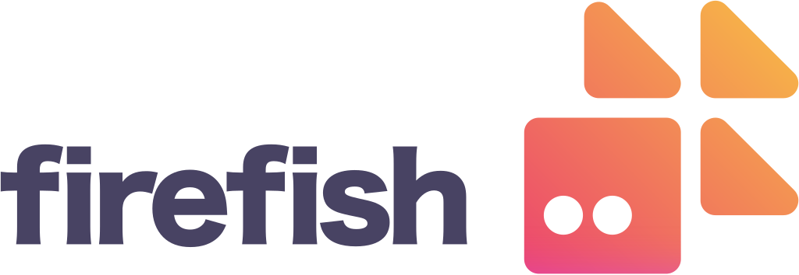

**🌎 Firefish 是一个开源的去中心化社交媒体平台，永远免费！🚀**

Firefish 基于 Misskey 开发，是 ActivityPub 协议上强大的微博客平台，拥有表情反应、可定制网页界面、丰富聊天功能等特性！

# 文档

- [安装指南](https://codeberg.org/firefish/firefish/src/branch/main/docs/install.md)
- [贡献指南](./CONTRIBUTING.md)
- [更新日志](https://codeberg.org/firefish/firefish/src/branch/main/docs/changelog.md)

# 相关链接

- Matrix 社群空间: <https://matrix.to/#/#firefish-community:nitro.chat>
- 翻译平台 Weblate: <https://hosted.weblate.org/engage/firefish/>

# 想要参与贡献？太好了！

- 如果您熟悉 TypeScript、Vue 或 Rust 编程，请阅读[贡献指南](./CONTRIBUTING.md)
- 如果您掌握其他语言，通过[Weblate](https://hosted.weblate.org/engage/firefish/) 翻译 Firefish 可以帮助更多人使用（无需技术背景）
